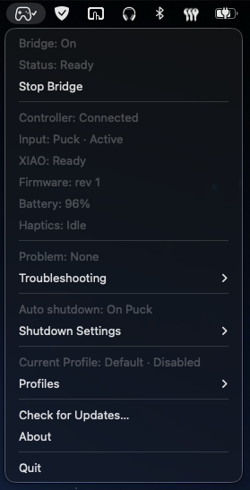
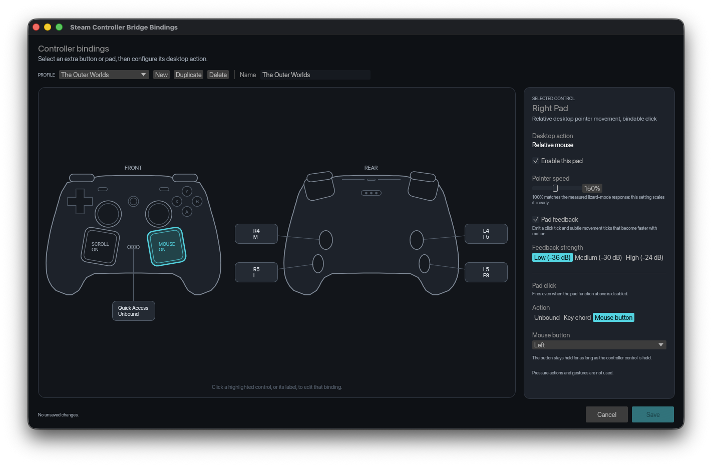
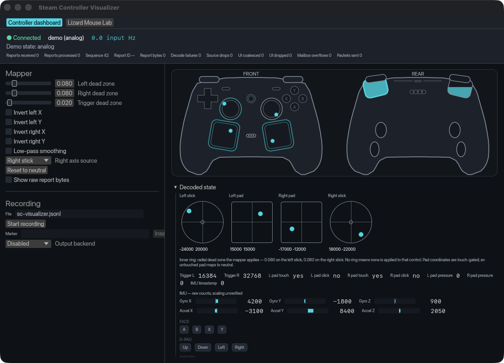

<p align="center">
  
</p>

<h1 align="center">Steam Controller Bridge</h1>

<p align="center"><strong>Your Steam Controller 2, everywhere macOS expects an Xbox gamepad.</strong></p>

<p align="center">
  <a href="https://github.com/tkubicz/steam-controller-bridge/releases/latest"></a>
  <a href="https://github.com/tkubicz/steam-controller-bridge/actions/workflows/ci.yml"></a>
  
  <a href="LICENSE"></a>
</p>

Steam Controller Bridge turns a **Steam Controller 2** into a standard
Xbox-layout USB gamepad for macOS. It works in browsers, native games, and cloud
gaming services - with no Steam client, kernel extension, or restricted virtual
HID entitlement in the path.

The controller connects through its official Puck or directly over Bluetooth.
A small protocol-compatible bridge device handles the gamepad-facing USB
connection, while the native menu app keeps setup, profiles, diagnostics, and
updates close at hand. Seeed Studio XIAO nRF52840/Sense is the first
project-supported firmware target; the serial protocol is public so other
devices can implement the bridge contract without inheriting XIAO identity.

> [!IMPORTANT]
> This project supports the **Steam Controller 2 (2026)**. The original 2015
> Steam Controller and its receiver use a different protocol and are not
> supported.

## See it in action

<table>
  <tr>
    <td width="28%" valign="top">
      
      <br />
      <strong>Live at a glance</strong><br />
      <sub>Start or stop the bridge, check hardware, switch profiles, and open updates from the menu bar.</sub>
    </td>
    <td width="72%" valign="top">
      
      <br />
      <strong>Make the extra controls yours</strong><br />
      <sub>Bind L4/L5/R4/R5, Quick Access, and pad clicks; configure right-pad pointer and left-pad scrolling per profile.</sub>
    </td>
  </tr>
</table>

<p align="center">
  
  <br />
  <strong>See every signal</strong><br />
  <sub>The visualizer exposes live controller geometry, decoded input, mapped output, diagnostics, recording, and the Lizard Mouse Lab.</sub>
</p>

## Why it exists

- **Play where macOS already understands gamepads.** The supported bridge presents the
  familiar Xbox 360-compatible layout used by Safari, games, and streaming
  clients.
- **Keep the controller experience.** Every standard control, both triggers,
  both sticks, the D-pad, and end-to-end dual rumble are carried through, while
  live battery state stays visible in the app.
- **Leave Steam out of the input path.** Automatic discovery, reconnects,
  neutralization, and lizard-mode suppression are owned by the bridge.
- **Use the controls games leave behind.** Extra paddles, Quick Access, and pad
  clicks can drive opt-in keyboard and mouse bindings without changing gamepad
  output.
- **Stay in control.** The native menu app reports what is connected, explains
  problems, records diagnostics, manages profiles, and verifies signed update
  metadata.

## What you need

- macOS 13 or later
- a Steam Controller 2
- the official Puck **or** a direct Bluetooth connection to the Mac
- a protocol-compatible serial bridge device connected by USB; today the
  project supplies firmware for XIAO nRF52840 and XIAO nRF52840 Sense

The bridge device makes the controller visible through Apple's normal
game-controller stack and keeps the current output independent of macOS
virtual-device entitlements. Zero-configuration implementations use the exact
USB product marker `Steam Controller Bridge` and complete the protocol-v1 Hello
handshake; implementations without the marker can be selected with an explicit
serial port.

## Get started

1. Download the macOS app from the
   [latest release](https://github.com/tkubicz/steam-controller-bridge/releases/latest).
2. Unzip `steam-controller-bridge-macos.zip`, move the app to Applications, then
   right-click it and choose **Open** on the first launch.
3. For the project-supported setup, connect one XIAO with a data-capable cable.
   In the menu app, choose **Check for Updates**, then
   **Install or Recover XIAO Firmware**.
4. When App Center asks for the XIAO bootloader, quickly press the tiny reset
   button beside the USB-C connector twice. App Center downloads, verifies,
   installs, and confirms the signed firmware. Later firmware updates are
   automatic.
5. Connect the controller, fully quit Steam and its helper, and start Steam
   Controller Bridge.

The [user guide](docs/USER_GUIDE.md) walks through hardware, pairing,
permissions, verification, recovery, and troubleshooting step by step.
Manual UF2 copying remains available as a recovery path when guided flashing
cannot complete.

## More than a bridge

- Native menu-bar status and controls
- Official Puck and direct Bluetooth input
- Xbox-layout USB gamepad output
- Dual-actuator rumble and pad feedback
- Per-profile keyboard, mouse, pointer, and scrolling bindings
- In-game radial profile switcher
- Automatic idle and Puck-dock shutdown options
- Signed application and firmware update metadata
- Live visualizer, JSONL recording, deterministic replay, and HID diagnostics
- Guided Lizard Mouse comparison lab

## Project status

The complete path is live-tested on macOS with both official Puck and direct
Bluetooth input. Safari's Gamepad API, Boosteroid, GeForce NOW, every physical
control, dual rumble, automatic discovery, and extended gameplay sessions have
all been exercised on hardware.

This is still an enthusiast project rather than a polished retail installer.
The app is ad-hoc signed and not notarized, and the firmware currently uses an
Xbox 360 compatibility USB identity so macOS publishes it through
GameController. Read the [known limitations](docs/TECHNICAL_GUIDE.md#known-limitations)
and [third-party notices](THIRD-PARTY-NOTICES.md) before distributing a build.

## Documentation

| Guide                                              | Use it for                                                        |
| -------------------------------------------------- | ----------------------------------------------------------------- |
| [User guide](docs/USER_GUIDE.md)                   | Setup, permissions, normal use, verification, and troubleshooting |
| [Technical guide](docs/TECHNICAL_GUIDE.md)         | Detailed commands, diagnostics, tools, and current limitations    |
| [Desktop bindings](docs/DESKTOP_BINDINGS.md)       | Profiles, actions, pad behavior, and persistence                  |
| [Profile wheel](docs/PROFILE_OVERLAY.md)           | Controller-driven switching over fullscreen and windowed games    |
| [Updates](docs/UPDATES.md)                         | Signed catalogs, application replacement, and firmware flashing   |
| [Architecture](docs/ARCHITECTURE.md)               | Workspace boundaries and runtime design                           |
| [Testing](docs/TESTING.md)                         | Automated, packaging, hardware, and manual acceptance gates       |
| [Firmware guide](firmware/xiao-nrf52840/README.md) | Native tests, automatic UF2 updates, receipts, recovery, and LED states |

Protocol and diagnostic references live in [`docs/`](docs/), including the
[Steam Controller protocol](docs/STEAM_CONTROLLER_PROTOCOL.md),
[serial transport](docs/SERIAL_TRANSPORT.md), [gamepad protocol](docs/GAMEPAD_PROTOCOL.md),
[mapping](docs/MAPPING.md), and [recording format](docs/RECORDING_FORMAT.md).

## Build from source

```bash
cargo build --workspace
cargo test --workspace
./tools/build-macos-app.py
```

The packaged app is written to `dist/Steam Controller Bridge.app` and ad-hoc
signed locally. The [technical guide](docs/TECHNICAL_GUIDE.md#build-and-test)
and [testing guide](docs/TESTING.md) cover the full validation matrix.

## Acknowledgements

Steam Controller Bridge probably would not exist without the work shared by
[OpenPuck](https://github.com/safijari/openpuck) and
[SDL](https://github.com/libsdl-org/SDL).

OpenPuck made essential Steam Controller 2 protocol research available and
provided an invaluable architectural reference for the hardware bridge. SDL's
Steam Controller 2/Triton driver documented the safe controller commands and
behavior that informed input handling, lizard-mode control, battery reporting,
rumble, and haptics. Thank you to both projects and everyone who contributed to
them.

## Contributing

Pull requests are welcome. The repository uses Conventional Commit PR titles,
squash merging, and Release Please. See [CONTRIBUTING.md](CONTRIBUTING.md) before
opening a change.

## License

MIT. Steam, Steam Controller, Xbox, macOS, and the named streaming services are
trademarks of their respective owners. This project is not affiliated with or
endorsed by Valve, Microsoft, Apple, or those services.
